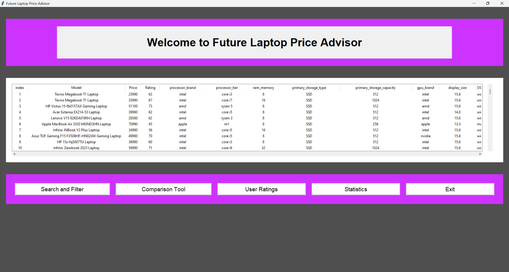
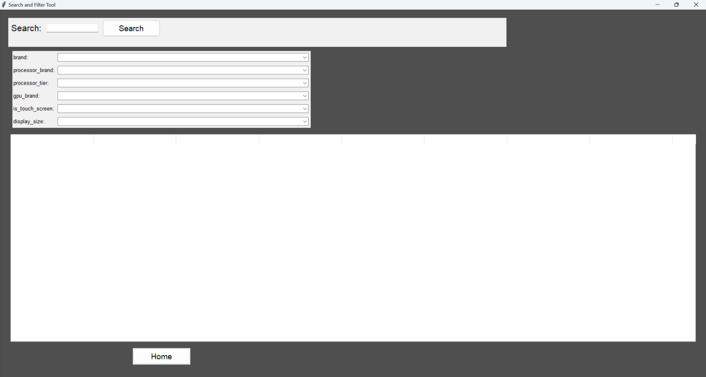
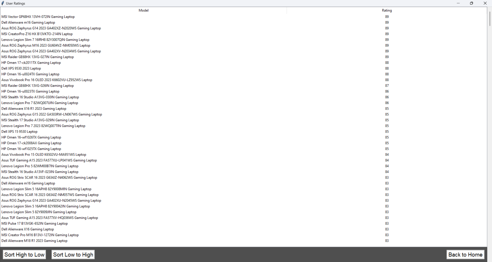
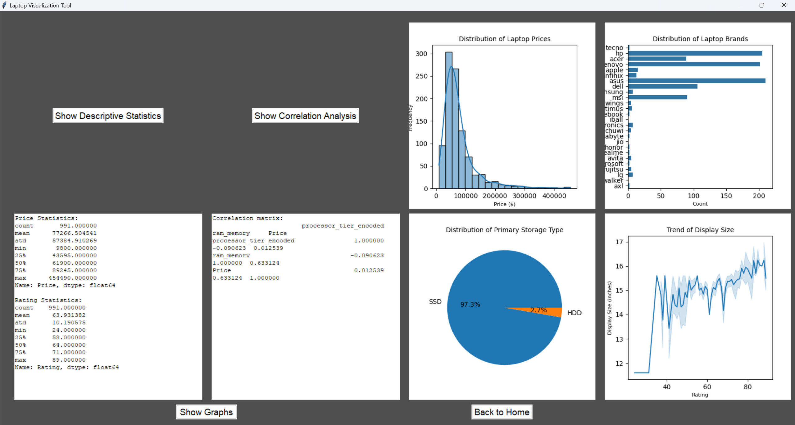

# Future-Laptop-Price-Advisor

## Description

LaptopPricePredictor is a project focused on utilizing a meticulously cleaned dataset sourced from the
'Smartprix' website, containing information on 991 unique laptops.
Enriched with 22 features including laptop brand, model, price, specifications, and more,
this dataset serves as a robust foundation for building predictive models and recommendation systems tailored to the
diverse needs of laptop consumers.

### Main Menu

### Search and filter Menu

### Compare Menu

### Statistic Menu

## Data Sources

https://www.kaggle.com/datasets/bhavikjikadara/brand-laptops-dataset/data

This meticulously cleaned dataset presents a comprehensive collection of 991 unique laptops sourced from the
'Smartprix' website. Enriched with 22 features including laptop name, price in Indian rupees, processor, GPU, and more,
it provides valuable insights for building robust price prediction models and effective recommendation systems.
Updated as of January 14, 2024, this dataset is a reliable foundation for exploring the intricate landscape of
laptop pricing dynamics and consumer preferences.

## Code Structure

1. [main.py](main.py) : Run Program.
2. [home.py](home.py) : Contain Home Page.
3. [searchandfilterpage.py](searchandfilterpage.py) : Contain Search And Filter Page.
4. [comparison.py](comparison.py) : Contain Comparison Page.
5. [rating.py](rating.py) : contain Rating Page.
6. [visualization.py](visualization.py) : Contain Visualization Page.

## Project Proposal, Development plan

[GitHub Wiki Home](https://github.com/TSpoomM/Future-Laptop-Price-Advisor.wiki.git)

## Installation

[GitHub Installation](https://github.com/TSpoomM/Future-Laptop-Price-Advisor.wiki.git)

## UML and Sequence Diagram

[GitHub Class and Sequence Diagram](https://github.com/TSpoomM/Future-Laptop-Price-Advisor.wiki.git)
